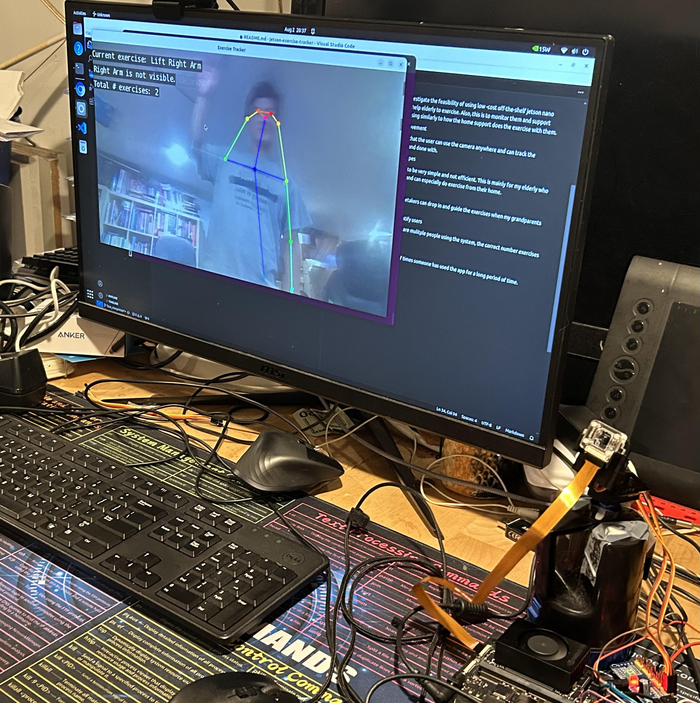

# jetson-exercise-tracker

## Background
My grandparents need some support to help them exercise. Their home support personel can only come twice a day for 10 minutes, so these exercises are often inadequate. My idea is to develop a low cost visual tracking system to guide them exercising. This is meant to help the elderly people to do the exercises they need. 

## Introduction
This is a project based on the NVIDIA's `jetson-inference` docker  container. https://github.com/dusty-nv/jetson-inference

An application layer is added. Also a servo-driven tracking camera is design to make the device usable in a tight space. 

## Roadmap
1. MVP

    The first goal of this is to investigate the feasibility of using low -cost off-the-shelf jetson nano and Raspberry PI camera to help elderly to exercise. Also, this is to monitor them and support them so that they are exercising similarly to how the home support does the exercise with them. 

2. Camera tracking/Camera Movement

    This will be made to ensure that the user can use the camera anywhere and can track the exercise that is being made and done with.
    

3. Programmable Exercise Recipes

    I want the exercise routines to be very simple and not efficient. This is mainly for my elderly who are injured or have sickness and can especially do exercise from their home. 

4. Video Streaming

    I want to ensure that the caretakers can drop in and guide the exercises when my grandparents need them. 

5. Use Face Recognition to identify users

    This is to ensure when there are mulitple people using the system, the correct number exercises are logged for each user. 

6. History tracking
    
    This is to track the amount of times someone has used the app for a long period of time.

## Hardware Specifications :
 
 * Nvidia Jetson Orin Nano (https://files.seeedstudio.com/wiki/Jetson-Orin-Nano-DevKit/jetson-orin-nano-developer-kit-datasheet.pdf)
    * NVIDIA Ampere architecture with 1024 NVIDIA® CUDA® cores with 32 tensor cores
    * 6-core Arm® Cortex-A78AE v8.2 64-bit CPU
    * 8GB 128-bit LPDDR5 68 GB/s
    
    OR 

* Nvidia Jetson Nano (https://www.nvidia.com/en-us/autonomous-machines/embedded-systems/jetson-nano/product-development/)

 * CSI Camera (IMX 219) (https://docs.arducam.com/Nvidia-Jetson-Camera/Native-Camera/imx219/)
  
  
  * Servo Connector (PCA8695) (https://www.adafruit.com/product/815)
  * Servo Motor (SG90) 2 axis (https://www.adafruit.com/product/1967)

## Installations:

After this project is cloned: 
1.  `./build.sh`or `./build-orin.sh` will build the docker image, depending on the system.
2.  `./run.sh` will run the docker container:

Video showing the camera tracking:

## Software Specifications:
* Nvidia Jetpack 4.6 for Nano (https://developer.nvidia.com/embedded/jetpack-sdk-46
* Nvidia Jetpack 6.0 for Orin (https://developer.nvidia.com/embedded/jetpack-sdk-60)